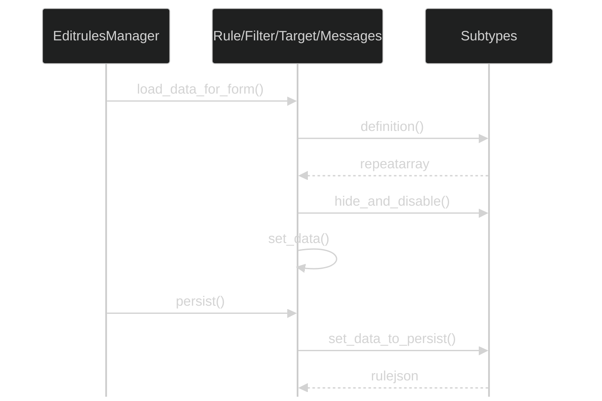

```mermaid
    %%{init: {
    "theme": "dark",
    "sequence": {
        "mirrorActors": false,
        "showSequenceNumbers": false
    }
    }}%%
    sequenceDiagram
        participant EditrulesManager
        participant Rule/Filter/Target/Messages
        participant Subtypes

        EditrulesManager->>Rule/Filter/Target/Messages: load_data_for_form()
        Rule/Filter/Target/Messages->>Subtypes: definition()
        Subtypes -->>Rule/Filter/Target/Messages: repeatarray
        Rule/Filter/Target/Messages->>Subtypes: hide_and_disable()
        Rule/Filter/Target/Messages->>Rule/Filter/Target/Messages: set_data()
        EditrulesManager->>Rule/Filter/Target/Messages: persist()
        Rule/Filter/Target/Messages->>Subtypes: set_data_to_persist()
        Subtypes -->>Rule/Filter/Target/Messages: rulejson
```