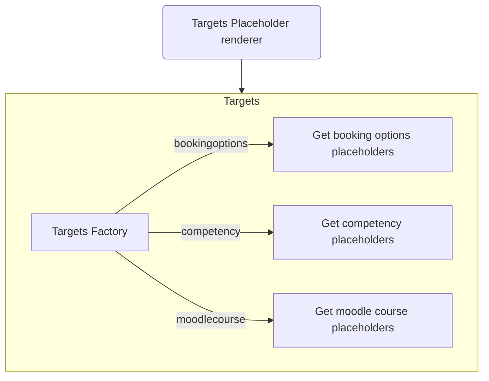

```mermaid
    graph TD
    %% External elements
    ExternalTrigger(
        Targets Placeholder renderer
    )

    %% Main component as subgraph
    subgraph AdhocComponent["Targets"]
        targets_factory["Targets Factory"]

        bookingoptions["Get booking options placeholders"]
        competency["Get competency placeholders"]
        moodlecourse["Get moodle course placeholders"]

        %% Internal relations
        targets_factory -- bookingoptions--> bookingoptions
        targets_factory -- competency--> competency
        targets_factory -- moodlecourse--> moodlecourse

    end

    %% External connections
    ExternalTrigger --> AdhocComponent
```