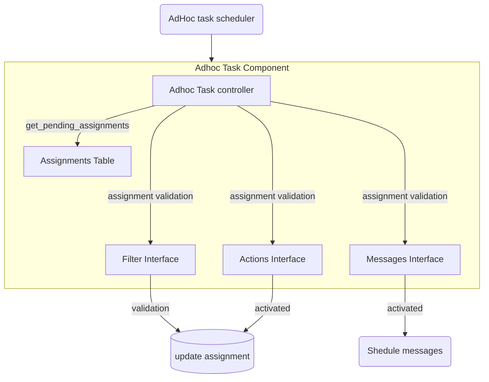

```mermaid
    graph TD
    %% External elements
    ExternalTrigger(
        AdHoc task scheduler
    )
    Assignments[(
        update assignment
    )]
    Messages(
        Shedule messages
    )

    %% Main component as subgraph
    subgraph AdhocComponent["Adhoc Task Component"]
        adhoc_controller["Adhoc Task controller"]
        assignments["Assignments Table"]
        filter["Filter Interface"]
        actions["Actions Interface"]
        messages["Messages Interface"]

        %% Internal relations
        adhoc_controller -- get_pending_assignments--> assignments
        adhoc_controller -- assignment validation ---> filter
        adhoc_controller -- assignment validation ----> actions
        adhoc_controller -- assignment validation ----> messages
    end

    %% External connections
    ExternalTrigger --> AdhocComponent
    filter -- validation --> Assignments
    actions -- activated --> Assignments
    messages -- activated --> Messages
```