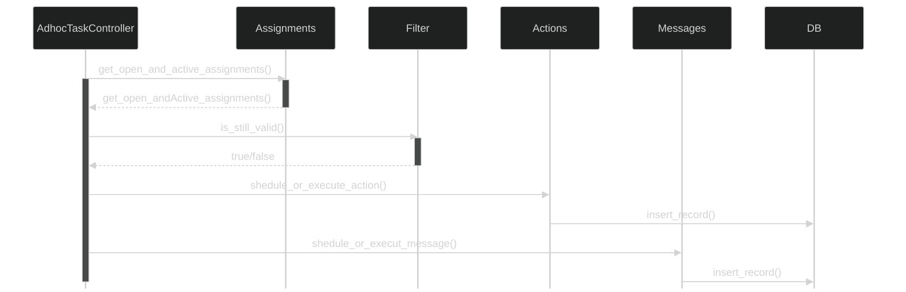

```mermaid
    %%{init: {
    "theme": "dark",
    "sequence": {
        "mirrorActors": false,
        "showSequenceNumbers": false
    }
    }}%%
    sequenceDiagram
        participant AdhocTaskController
        participant Assignments
        participant Filter
        participant Actions
        participant Messages
        participant DB

        AdhocTaskController->>Assignments: get_open_and_active_assignments()
        activate AdhocTaskController

        activate Assignments
        Assignments-->>AdhocTaskController: get_open_andActive_assignments()
        deactivate Assignments

        AdhocTaskController->>Filter: is_still_valid()
        activate Filter
        Filter-->>AdhocTaskController: true/false
        deactivate Filter

        AdhocTaskController->>Actions: shedule_or_execute_action()
        Actions->>DB: insert_record()
        AdhocTaskController->>Messages: shedule_or_execut_message()
        Messages->>DB: insert_record()
        deactivate AdhocTaskController
```