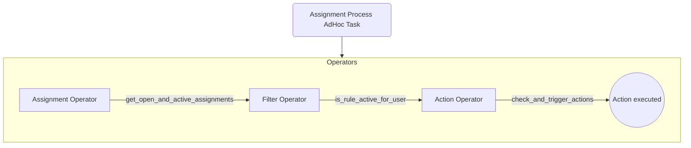

```mermaid
    graph TD
    %% External elements
    ExternalTrigger(
        Assignment Process AdHoc Task
    )

    %% Main component as subgraph
    subgraph AdhocComponent["Operators"]

        filter_operator["Filter Operator"]
        assignment_operator["Assignment Operator"]
        action_operator["Action Operator"]
        action(("Action executed"))

        %% Internal relations
        assignment_operator -- get_open_and_active_assignments--> filter_operator
        filter_operator -- is_rule_active_for_user--> action_operator
        action_operator -- check_and_trigger_actions--> action

    end

    %% External connections
    ExternalTrigger --> AdhocComponent
```