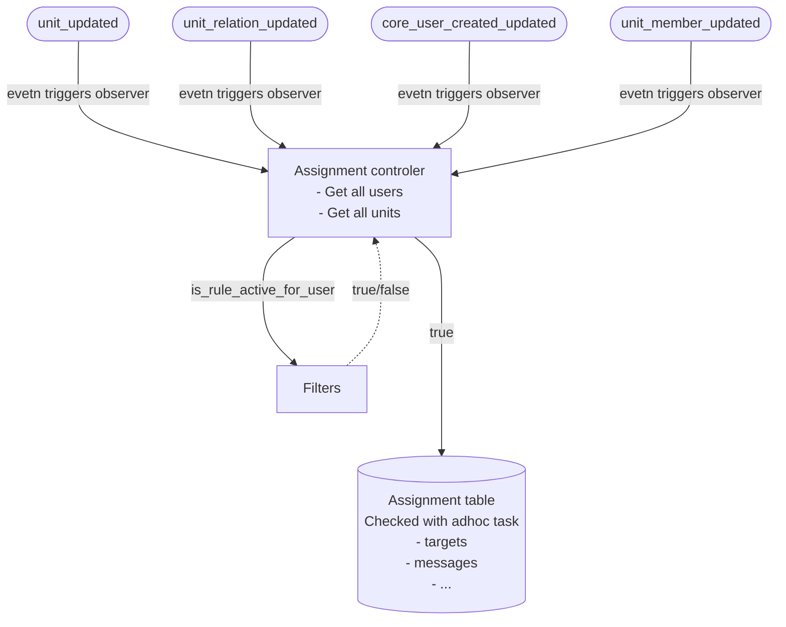

```mermaid
flowchart TD
    %% Definition
    unit_updated([
        unit_updated
    ])
    unit_relation_updated([
        unit_relation_updated
    ])
    core_user_created_updated([
        core_user_created_updated
    ])
    unit_member_updated([
        unit_member_updated
    ])
    Assignment_controler[
        Assignment controler
        - Get all users
        - Get all units
    ]
    Filters[Filters]

    DB_Assignment[(
        Assignment table
        Checked with adhoc task
        - targets
        - messages
        - ...
    )]

    %% Struktur
    unit_updated -- evetn triggers observer ---> Assignment_controler
    unit_relation_updated -- evetn triggers observer ---> Assignment_controler
    core_user_created_updated -- evetn triggers observer ---> Assignment_controler
    unit_member_updated -- evetn triggers observer ---> Assignment_controler
    Assignment_controler -- is_rule_active_for_user ---> Filters
    Filters -. true/false .-> Assignment_controler
    Assignment_controler -- true ----> DB_Assignment
```