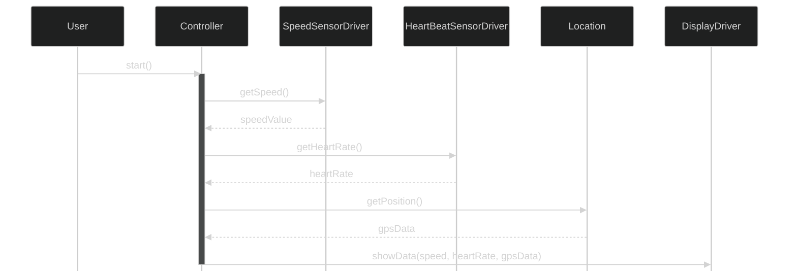

```mermaid
    %%{init: {"theme": "dark", "sequence": {"mirrorActors": false, "actorFontSize": 14, "noteFontSize": 12, "messageFontSize": 14}}}%%
    sequenceDiagram
        participant User
        participant Controller
        participant SpeedSensorDriver
        participant HeartBeatSensorDriver
        participant Location
        participant DisplayDriver

        User->>Controller: start()
        activate Controller

        Controller->>SpeedSensorDriver: getSpeed()
        SpeedSensorDriver-->>Controller: speedValue

        Controller->>HeartBeatSensorDriver: getHeartRate()
        HeartBeatSensorDriver-->>Controller: heartRate

        Controller->>Location: getPosition()
        Location-->>Controller: gpsData

        Controller->>DisplayDriver: showData(speed, heartRate, gpsData)
        deactivate Controller
```