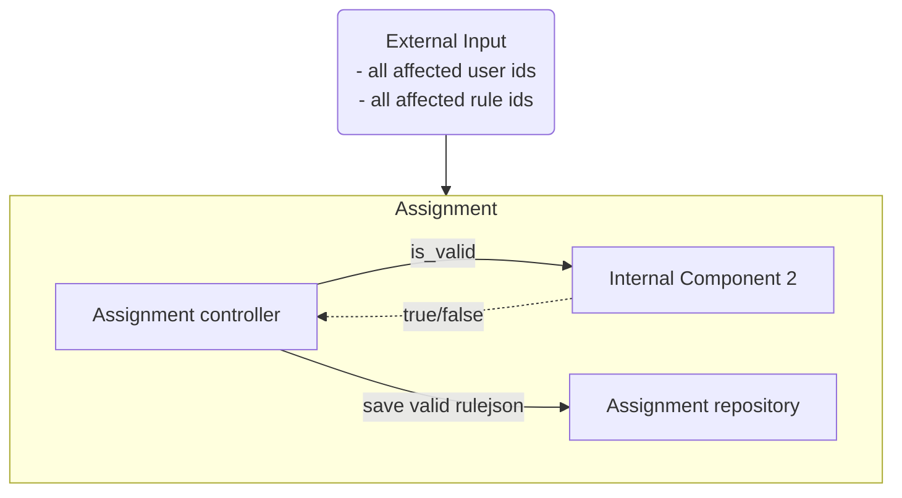

```mermaid
graph TD
        %% External elements
    ExternalInput(
        External Input
        - all affected user ids
        - all affected rule ids
    )

    %% Main component as subgraph
    subgraph AssignmentComponent["Assignment"]
        assign_controller["Assignment controller"]
        filter["Internal Component 2"]
        assign_repo["Assignment repository"]

        %% Internal relations
        assign_controller -- is_valid--> filter
        filter -. true/false.-> assign_controller
        assign_controller -- save valid rulejson --> assign_repo
    end

    %% External connections
    ExternalInput --> AssignmentComponent
```