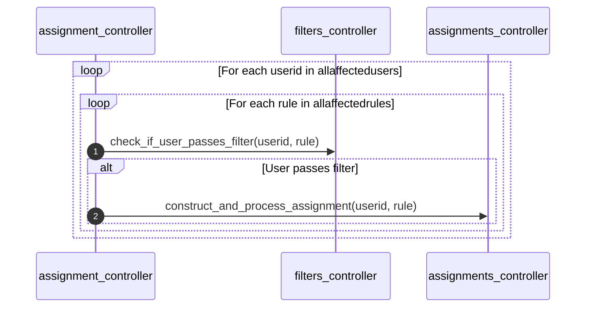

```mermaid
    sequenceDiagram
    autonumber
    participant AController as assignment_controller
    participant Filter as filters_controller
    participant Assignment as assignments_controller

    loop For each userid in allaffectedusers
        loop For each rule in allaffectedrules
            AController->>Filter: check_if_user_passes_filter(userid, rule)
            alt User passes filter
                AController->>Assignment: construct_and_process_assignment(userid, rule)
            end
        end
    end
```