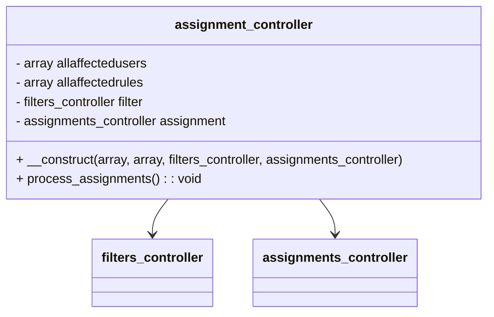

```mermaid
    classDiagram
        class assignment_controller {
            - array allaffectedusers
            - array allaffectedrules
            - filters_controller filter
            - assignments_controller assignment
            + __construct(array, array, filters_controller, assignments_controller)
            + process_assignments(): void
        }

        assignment_controller --> filters_controller
        assignment_controller --> assignments_controller
```