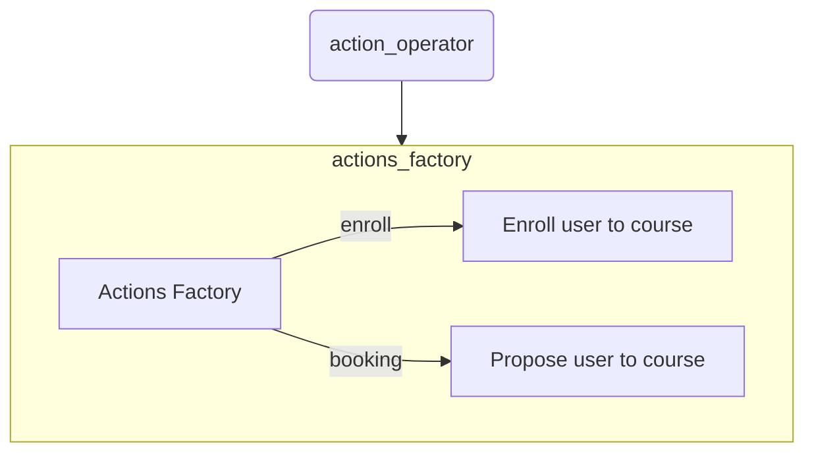

```mermaid
    graph TD
    %% External elements
    ExternalTrigger(
        action_operator
    )

    %% Main component as subgraph
    subgraph AdhocComponent["actions_factory"]

        adhoc_controller["Actions Factory"]
        enroll["Enroll user to course"]
        propose["Propose user to course"]

        %% Internal relations
        adhoc_controller -- enroll--> enroll
        adhoc_controller -- booking--> propose
    end

    %% External connections
    ExternalTrigger --> AdhocComponent
```