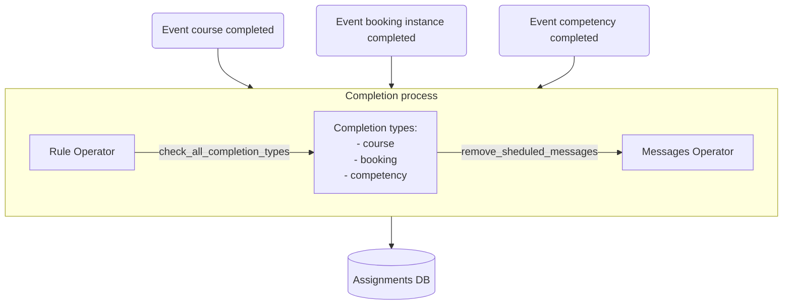

```mermaid
    graph TD
    %% External elements
    ExternalCourse(Event course completed)
    ExternalBooking(Event booking instance completed)
    ExternalCompetency(Event competency completed)
    DBAssignment[(Assignments DB)]

    %% Main component as subgraph
    subgraph CompletionProcess["Completion process"]
        rule_operator["Rule Operator"]
        completion_type_operator["
        Completion types:
            - course
            - booking
            - competency
        "]
        message_operator["Messages Operator"]
        %% Internal relations
        rule_operator -- check_all_completion_types--> completion_type_operator
        completion_type_operator -- remove_sheduled_messages--> message_operator
    end

    %% External connections
    ExternalCourse --> CompletionProcess
    ExternalBooking --> CompletionProcess
    ExternalCompetency --> CompletionProcess
    CompletionProcess --> DBAssignment
```