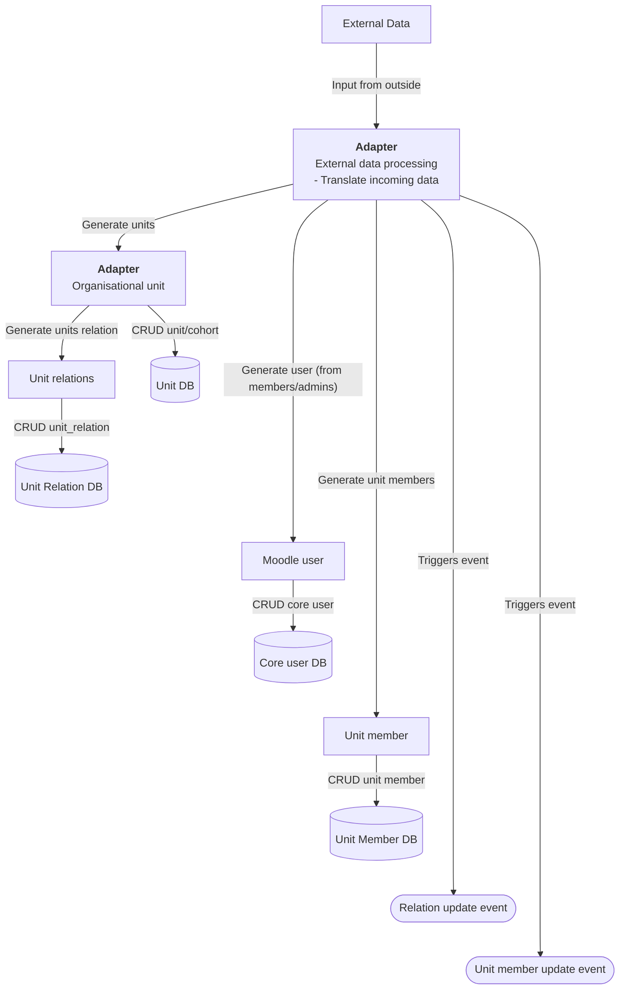

```mermaid
flowchart TD
%% //
    %% Definition
    INPUT[External Data]
    ADAPTER[
        <b>Adapter</b>
        External data processing
        - Translate incoming data
    ]
    Organisational_unit[
        <b>Adapter</b>
        Organisational unit
    ]
    Unit_relations[Unit relations]
    Moodle_user[Moodle user]
    Unit_member[Unit member]
    Relation_update_event([Relation update event])
    Unit_member_update_event([Unit member update event])
    DB_Unit[(Unit DB)]
    DB_Unit_Relation[(Unit Relation DB)]
    DB_Moodle_user[(Core user DB)]
    DB_Unit_member[(Unit Member DB)]

    %% Struktur
    INPUT -- Input from outside ---> ADAPTER
    ADAPTER -- Generate units --> Organisational_unit
    ADAPTER -- Generate user (from members/admins) -----> Moodle_user
    ADAPTER -- Generate unit members -------> Unit_member
    ADAPTER -- Triggers event ---------> Relation_update_event
    ADAPTER -- Triggers event ----------> Unit_member_update_event

    Organisational_unit -- Generate units relation --> Unit_relations

    Unit_relations -- CRUD unit_relation --> DB_Unit_Relation
    Organisational_unit -- CRUD unit/cohort --> DB_Unit
    Moodle_user -- CRUD core user --> DB_Moodle_user
    Unit_member -- CRUD unit member --> DB_Unit_member
```