# Bulk send checker

The bulk send checker is a safety net in front of the message sending of `local_taskflow`.
A rule that suddenly matches hundreds of users would otherwise mail all of them at once.
Instead, sending of a checked message is **postponed by a delay**, every queued send is
**recorded**, and when a postponed task finally runs it **counts the sends of the same
message and rule around its own sending time**. If that count is over the limit the send is
**parked** instead of carried out, and a human decides whether the burst goes out or not.

## Files

| File | Role |
| --- | --- |
| `bulk_check.php` | The checker itself: record, verdict, release, dismiss, cleanup, notification |
| `bulk_check_config.php` | Global settings plus the per message row, cached as one blob |
| `../types/standard.php` | Applies the delay when scheduling and records the queued send |
| `../../../task/send_taskflow_message.php` | Asks for the verdict before it sends, marks the row sent afterwards |
| `../../../task/release_bulk_check.php` | Turns released rows back into send tasks, in batches |
| `../../../task/bulk_check_reminder.php` | Daily digest of everything still parked |
| `../../../task/bulk_check_cleanup.php` | Daily tidy-up of orphaned pending rows and stale releases |
| `../../../table/bulk_check_table.php` | The wunderbyte table and its four actions |
| `../../../output/bulkcheck.php` + `/bulkcheck.php` | The page an admin takes the decision on |

## Components

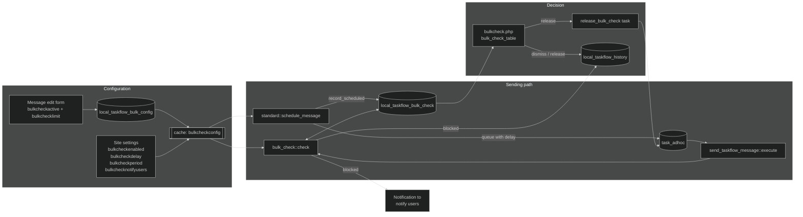

## The main flow

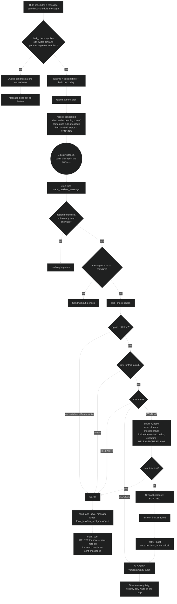

Two details of `check()` are worth keeping in mind:

* The **verdict is taken per task**, but it is **stable across a burst**, because the window
  is centred on the sending time rather than looking only backwards. Every row of one burst
  sees every other row, so cron reaches the same answer no matter in which order it works
  through the tasks.
* A **blocked row keeps counting**. A released or releasing one does not — otherwise the
  sends just let through would be measured against their own limit and blocked again, and
  no mail would ever leave.
* A **sent row does not exist**. The moment the mail is out its row is deleted, and the send
  counts through `local_taskflow_sent_messages` instead, which the sending writes anyway.
  That is what catches a slow flood without keeping a second copy of every send.

## The counting window

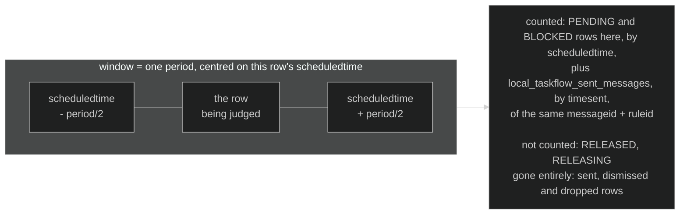

## Status of a row

`local_taskflow_bulk_check.status`. The values `1`, `4` and `5` once meant *sent*,
*superseded* and *dismissed*; none is a state any more. A send that will never happen is
deleted rather than parked in a final status, and a send that did happen is deleted because
`local_taskflow_sent_messages` already records it. The numbers stay unused.

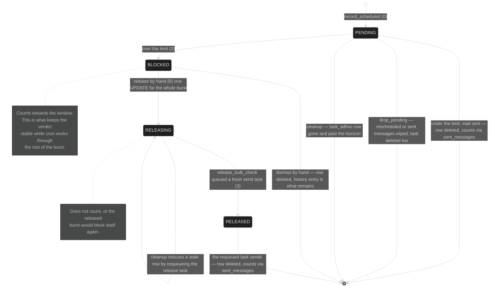

## Blocking a burst and telling somebody

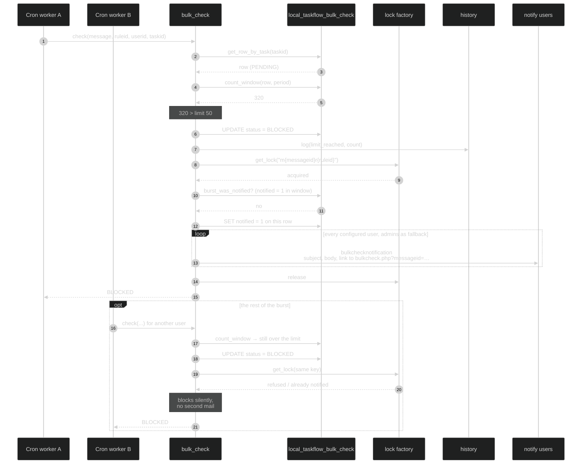

The daily `bulk_check_reminder` picks up where that single alert stops: it sends one digest
per notify user listing every parked burst and how long it has waited, and goes quiet by
itself once nothing is parked.

## Releasing a burst

The page never queues the send tasks itself. A burst can hold thousands of rows, and a
timeout half way through would leave it split between two states with no way to tell which
rows had been dealt with. So the request only flips the rows in **one statement** and hands
the queueing to a background task.

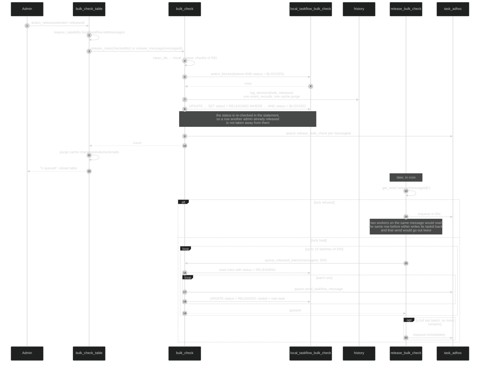

When the requeued `send_taskflow_message` finally runs, `check()` sees `STATUS_RELEASED` and
returns `SEND` without counting anything — the decision has already been taken by a person.

## Dismissing a burst

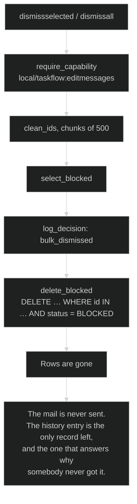

Dismissed rows are deleted rather than kept in a final status: a send that will never happen
cannot influence a verdict and would only make the table grow.

## The admin page

`/local/taskflow/bulkcheck.php`, reachable from the site settings and straight from the
alert with `?messageid=…`.

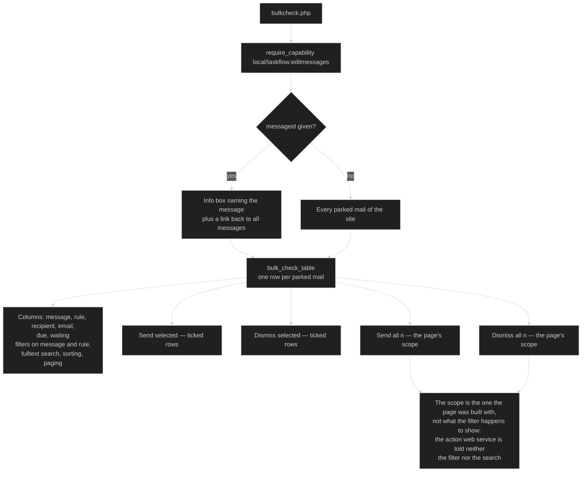

Deliberately, the page does **not** check `bulkcheckenabled`: switching the feature off must
never hide mails that are already parked, or they would be abandoned with no way to reach
them. Message and rule are joined loosely everywhere and fall back to a placeholder, so rows
whose message or rule was deleted stay visible and disposable.

## Cleanup

Daily, and it runs whether or not the check is switched on — the rows of a check that was
switched off are exactly the ones nobody will look at again. Rows leave the table on their
own when they stop mattering (sent, dismissed, rescheduled); the cleanup only looks for the
two cases that cannot announce themselves. Deleting is batched, because a burst can leave
thousands of orphans behind and one unbounded statement would lock the table for the
duration.

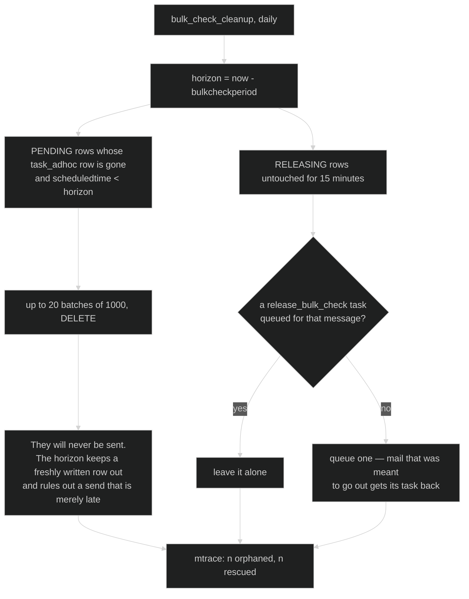

## Configuration

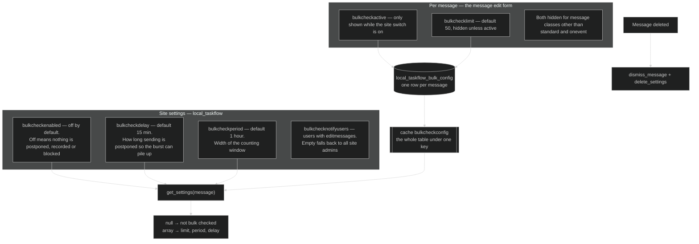

Only the **limit** is per message. The window and the delay are global, so that sending stays
regular and nobody has to look up a different value for each message. `applies()` runs once
per assignee while a rule schedules its messages, which is why the whole config table is read
once into a cache instead of being queried per message. Every write goes through
`set_settings()`, which invalidates that cache.

## Tables

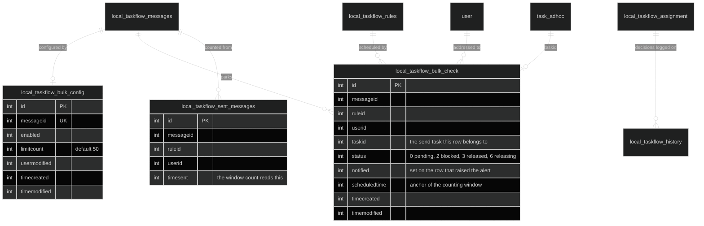

Indexes on the check table: `messageid, ruleid, scheduledtime` for the window count,
`taskid` for the per task lookup, `status, messageid` for the page, and
`status, scheduledtime` for the cleanup. The sent messages carry
`messageid, ruleid, timesent` for the same window count.

## History entries

| Type | Written when |
| --- | --- |
| `limit_reached` | `check()` blocks a send, with the count that triggered it |
| `bulk_released` | An admin lets parked sends go out |
| `bulk_dismissed` | An admin gives up on parked sends — the only remaining record |

All three hang off the assignment, so a row whose assignment is already gone is skipped.
Decisions are written with one `insert_records` and a single cache purge, because
`history::log()` purges on every call and a burst can hold thousands of rows.
