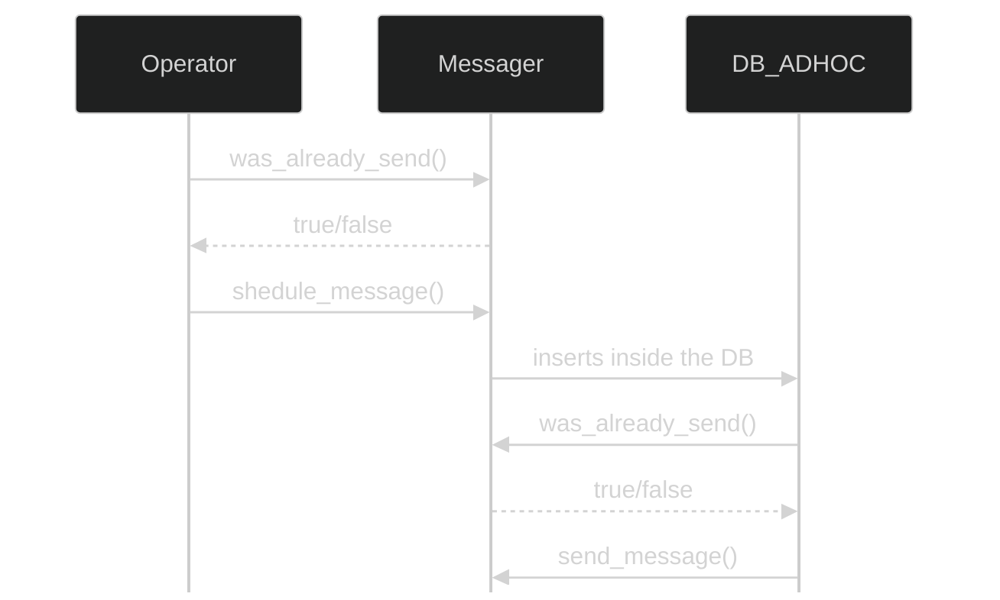

```mermaid
    %%{init: {
    "theme": "dark",
    "sequence": {
        "mirrorActors": false,
        "showSequenceNumbers": false
    }
    }}%%
    sequenceDiagram
        participant Operator
        participant Messager
        participant DB_ADHOC

        Operator->>Messager: was_already_send()
        Messager-->>Operator: true/false

        Operator->>Messager: shedule_message()
        Messager->>DB_ADHOC: inserts inside the DB

        DB_ADHOC->>Messager: was_already_send()
        Messager-->>DB_ADHOC: true/false
        DB_ADHOC->>Messager: send_message()
```