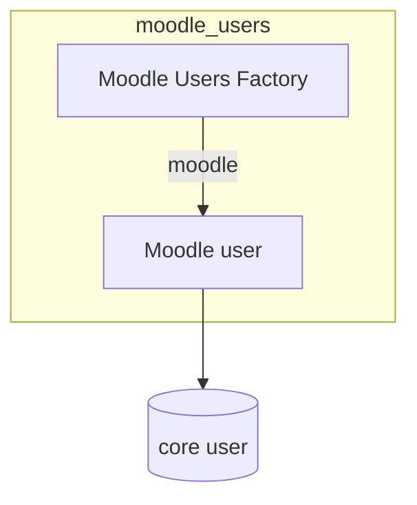

```mermaid
    graph TD
    Assignments[(
        core user
    )]

    %% Main component as subgraph
    subgraph AssignmentComponent["moodle_users"]
        assign_controller["Moodle Users Factory"]
        filter["Moodle user"]

        %% Internal relations
        assign_controller -- moodle --> filter
    end

    %% External connections
    filter --> Assignments
```