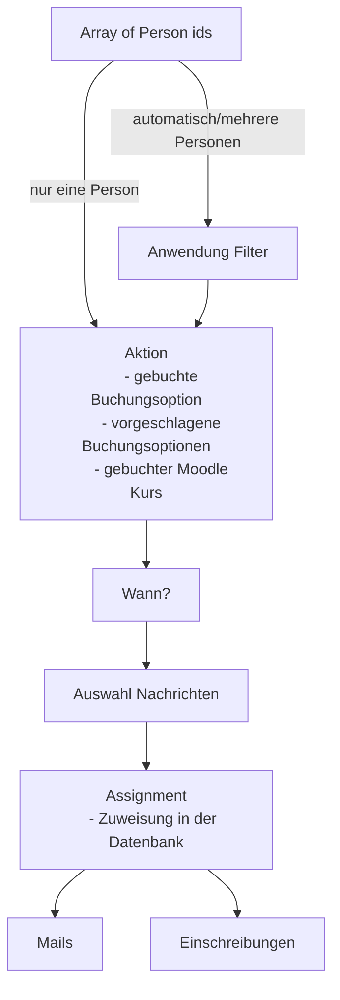

Todo:

- Wer ist betroffen?
- Unit

- Gib mir alle Personen einer Unit
- Gib mir genau eine Person

- Filter für Personen?
- Wann soll das gemacht werden?

- Wende Regel nicht an, wenn das Ergebnis bereits erreicht.

Zwei Alternativen:
A) Regeln haben zusätzlich Personenfilter Möglichkeit (z.b. nur Vorgesetzte, nur Arbeiter, nur Leute mit Vornamen Hans)
B) Regeln beziehen sich immer auf alle Leute in einer Unit. Wenn nur Hans, ist UNIT Hans eine Unterunit.

Gewwählt wird A).

Was soll passieren?

- schreib sie in eine Buchungsoption ein
- schlag ihnen eine Buchungsoption vor
- schreib sie in einen Moodle Kurs ein

Zeitfrage.

Definition Assignement:

eine bestimmte Person (userid) muss etwas zu einem bestimmten zeitpunkt machen.

Bsp: "Buche ab Datum X und vor Datum Y einen bestimmen Kurs"

Sanktionen:
Wenn Du es nicht machst
- Bekommst Du am Zeitpunkt Y + a ein Mail
- Bekommt Dein Vorgesetzer am Zeitpunkt Y + b ein Mail

Liste Nachrichten
- Du hast eine neue Zuweisung:
- Dein Kurs fängt an in x Tagen
- Du hast eine Frist versäumt

{
    "ID": x,
    "ruletype": "standard",
    "filter": [
        "targetfield1name": "role",
        "targetfield1value": "vorgesetzer",
        "operator": "=",
    ],
    "action": [
        "type": "enroltobookingoption",
        ...
    ]
    "time": [
        xxx
    ],
    "messages": [
        [
            "ID": x,
        ],
        [
            "ID": y,
        ]
    ]
}