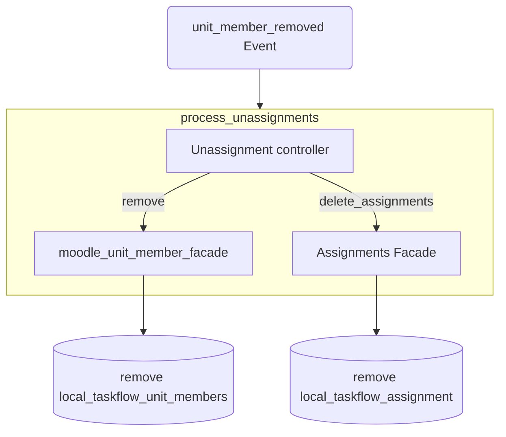

```mermaid
    graph TD
    %% External elements
    ExternalInput(
        unit_member_removed Event
    )
    Assignments[(
        remove local_taskflow_assignment
    )]
    Unitmembers[(
        remove local_taskflow_unit_members
    )]

    %% Main component as subgraph
    subgraph AssignmentComponent["process_unassignments"]
        assign_controller["Unassignment controller"]
        filter["moodle_unit_member_facade"]
        assign_repo["Assignments Facade"]

        %% Internal relations
        assign_controller -- remove--> filter
        assign_controller -- delete_assignments --> assign_repo
    end

    %% External connections
    ExternalInput --> AssignmentComponent
    assign_repo --> Assignments
    filter --> Unitmembers
```