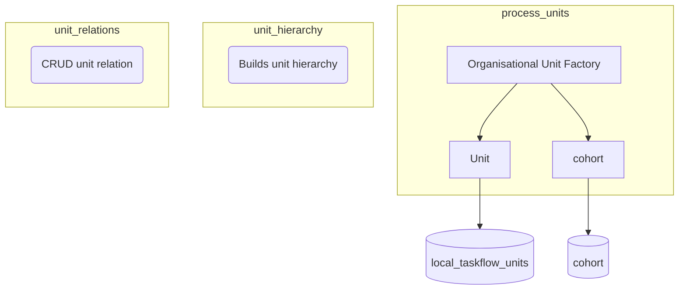

```mermaid
    graph TD
    Assignments[(
        cohort
    )]
    Unitmembers[(
        local_taskflow_units
    )]

    %% Main component as subgraph
    subgraph AssignmentComponent["process_units"]
        assign_controller["Organisational Unit Factory"]
        filter["Unit"]
        assign_repo["cohort"]

        %% Internal relations
        assign_controller --> filter
        assign_controller --> assign_repo
    end

    %% Main component as subgraph
    subgraph HierachyComponent["unit_hierarchy"]
        controller("Builds unit hierarchy")
    end

    %% Main component as subgraph
    subgraph RelationComponent["unit_relations"]
        classes("CRUD unit relation")
    end

    %% External connections
    assign_repo --> Assignments
    filter --> Unitmembers
```