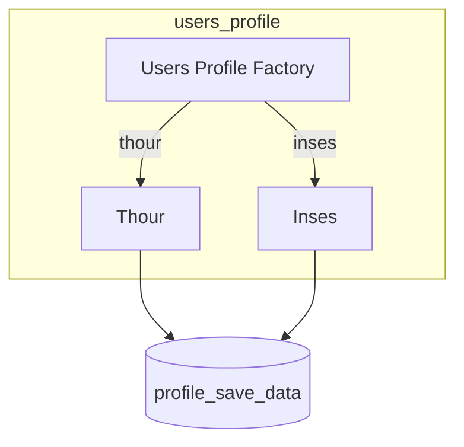

```mermaid
    graph TD
    Assignments[(
        profile_save_data
    )]

    %% Main component as subgraph
    subgraph AssignmentComponent["users_profile"]
        assign_controller["Users Profile Factory"]
        filter["Inses"]
        assign_repo["Thour"]

        %% Internal relations
        assign_controller -- inses --> filter
        assign_controller -- thour --> assign_repo
    end

    %% External connections
    assign_repo --> Assignments
    filter --> Assignments
```