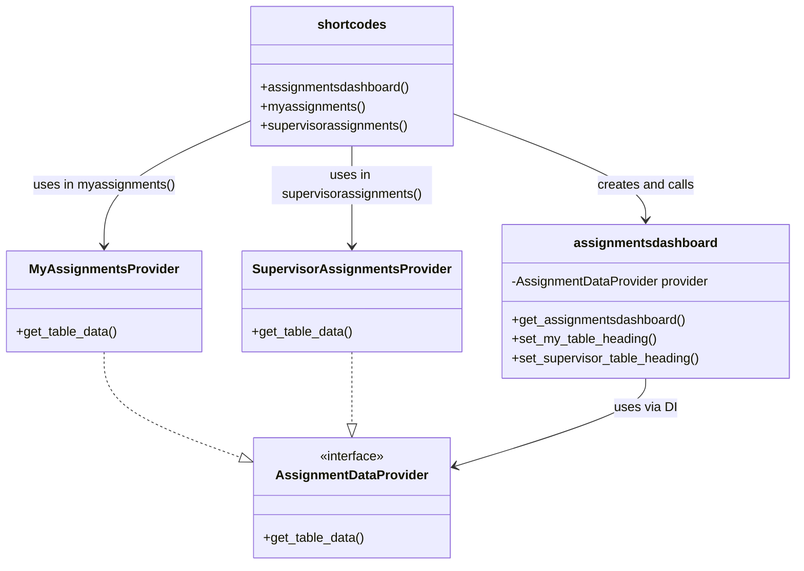

Benefits of This Design

- Decouples data source logic from rendering
- Easier testing: you can mock AssignmentDataProvider
- Flexible: you can add ArchivedAssignmentsProvider, HRDashboardProvider, etc., without modifying assignmentsdashboard