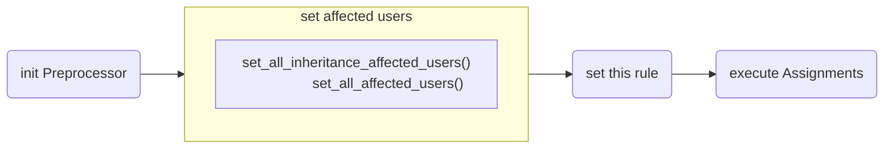
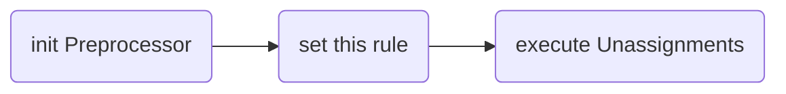
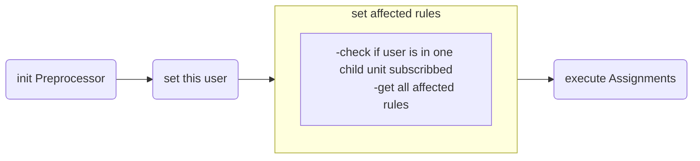
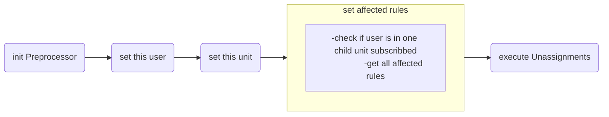
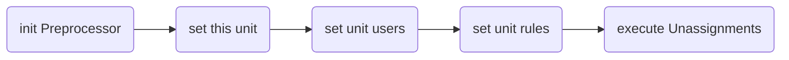

### Update Rule

```mermaid
    graph LR
        %% External elements
        Preprocessor(
            init Preprocessor
        )
        setUsers(
            set affected users
        )
        setRule(
            set this rule
        )
        Execute(
            execute Assignments
        )

        %% Main component as subgraph
        subgraph setUsers["set affected users"]
            direction TB
            set_all_inheritance_affected_users["
                set_all_inheritance_affected_users()
                set_all_affected_users()
            "]
        end

        %% External connections
        Preprocessor --> setUsers
        setUsers --> setRule
        setRule --> Execute
```
### Removed Rule

```mermaid
    graph LR
        %% External elements
        Preprocessor(
            init Preprocessor
        )
        setRule(
            set this rule
        )
        Execute(
            execute Unassignments
        )

        %% External connections
        Preprocessor --> setRule
        setRule --> Execute
```
### Unit Member Updated

```mermaid
    graph LR
        %% External elements
        Preprocessor(
            init Preprocessor
        )
        setUser(
            set this user
        )
        Execute(
            execute Assignments
        )

        %% Main component as subgraph
        subgraph setRules["set affected rules"]
            direction TB
            set_all_inheritance_affected_users["
            -check if user is in one child unit subscribbed
            -get all affected rules
            "]
        end

        %% External connections
        Preprocessor --> setUser
        setUser --> setRules
        setRules --> Execute
```
### Unit Member Removed

```mermaid
    graph LR
        %% External elements
        Preprocessor(
            init Preprocessor
        )
        setUser(
            set this user
        )
        setUnit(
            set this unit
        )
        Execute(
            execute Unassignments
        )

        %% Main component as subgraph
        subgraph setRules["set affected rules"]
            direction TB
            set_all_inheritance_affected_users["
                -check if user is in one child unit subscribbed
                -get all affected rules
            "]
        end

        %% External connections
        Preprocessor --> setUser
        setUser --> setUnit
        setUnit --> setRules
        setRules --> Execute
```
### Unit Removed

```mermaid
    graph LR
        %% External elements
        Preprocessor(
            init Preprocessor
        )
        setUnit(
            set this unit
        )
        setUser(
            set unit users
        )
        setRules(
            set unit rules
        )
        Execute(
            execute Unassignments
        )

        %% External connections
        Preprocessor --> setUnit
        setUnit --> setUser
        setUser --> setRules
        setRules --> Execute
```