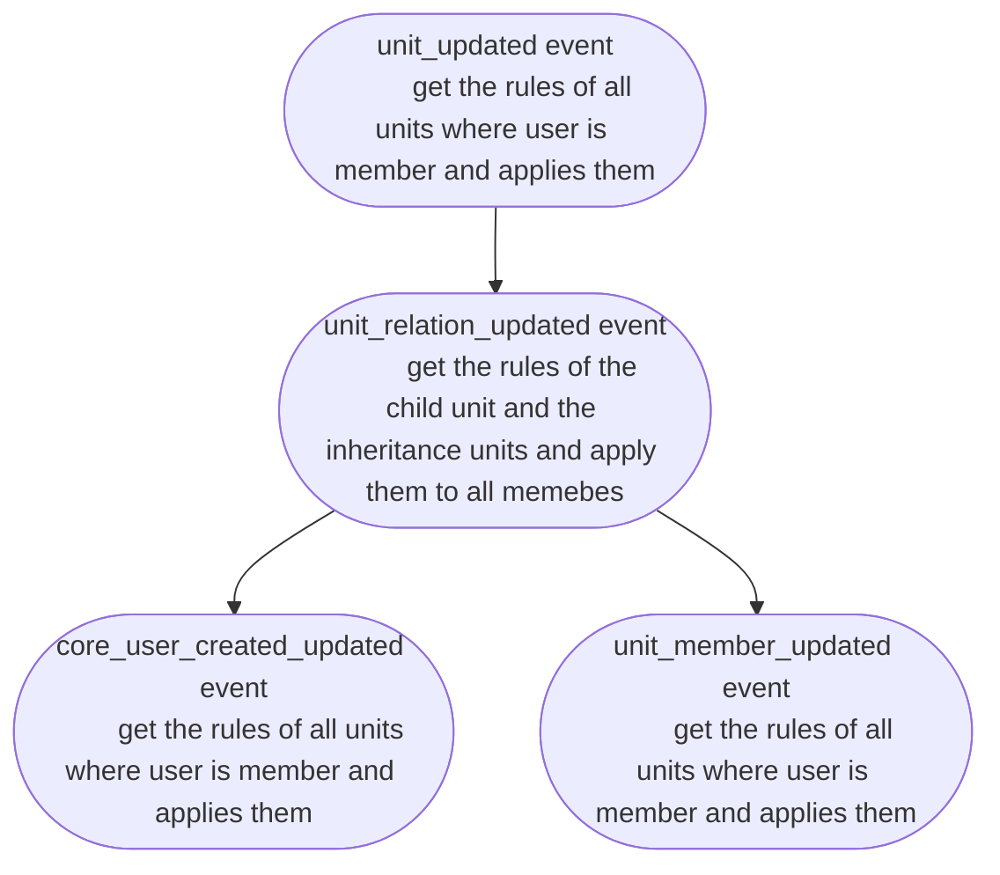

```mermaid
flowchart TD
%% //
    %% Events
    EVENT_unit_relation([
        unit_relation_updated event
        get the rules of the child unit and the inheritance units and apply them to all memebes
        ])
    EVENT_unit_member([
        unit_member_updated event
        get the rules of all units where user is member and applies them
    ])
    EVENT_core_user([
        core_user_created_updated event
        get the rules of all units where user is member and applies them
    ])
    EVENT_unit_updated([
        unit_updated event
        get the rules of all units where user is member and applies them
    ])

    %% Flow-Struktur
    EVENT_unit_updated --> EVENT_unit_relation
    EVENT_unit_relation --> EVENT_core_user
    EVENT_unit_relation --> EVENT_unit_member
```