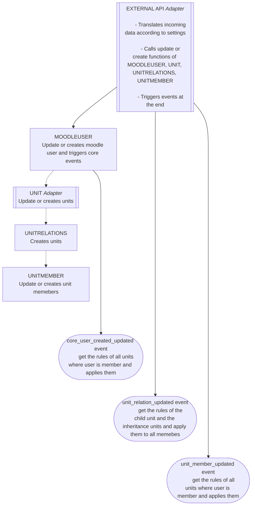

```mermaid
flowchart TD
%% //
     %% Verarbeitende API
    EXTERNALAPI[[
        EXTERNAL API <i>Adapter</i><br>
        - Translates incoming data according to settings<br>
        - Calls update or create functions of MOODLEUSER, UNIT, UNITRELATIONS, UNITMEMBER<br>
        - Triggers events at the end
    ]]

    %% Datenknoten
    MOODLEUSER[MOODLEUSER<br>Update or creates moodle user and triggers core events]
    UNIT[[UNIT <i>Adapter</i><br>Update or creates units]]
    UNITRELATIONS[UNITRELATIONS<br>Creates units]
    UNITMEMBER[UNITMEMBER<br>Update or creates unit memebers]

    %% Events
    EVENT1([
        unit_relation_updated event
        get the rules of the child unit and the inheritance units and apply them to all memebes
        ])
    EVENT2([
        unit_member_updated event
        get the rules of all units where user is member and applies them
    ])
    EVENT3([
        core_user_created_updated event
        get the rules of all units where user is member and applies them
    ])

    %% Flow-Struktur
    EXTERNALAPI --> MOODLEUSER
    MOODLEUSER -.-> UNIT
    UNIT -.-> UNITRELATIONS
    UNITRELATIONS -.-> UNITMEMBER

    %% Events werden ausgelöst
    EXTERNALAPI --------> EVENT1
    EXTERNALAPI ---------> EVENT2
    MOODLEUSER ------> EVENT3
```